# How to Back Up a Raspberry Pi SD Card on Windows
###### by Alton Campbell

###### Required Tools:
- Micro SD card adapter  
- Internet Connection  
- 4 GB or bigger usb stick (or an extra SD card for ubuntu)
- One USB port

###### Required Software:  
- Win32DiskImager (https://sourceforge.net/projects/win32diskimager/)  
- Rufus (https://rufus.akeo.ie/)  
- Ubuntu or another debian-based linux os (https://www.ubuntu.com/download/desktop)
***

### WARNING: Be extremely careful as you follow these instructions. If you aren't sure of something or have a question, *be sure to ask for help*. Using these tools could *seriously damage* or *permanently delete* your data and files if you use them improperly.      
***

###### Installing Ubuntu on a USB stick:  
If you have downloaded the ubuntu image, rufus, and win32diskimager, you're ready to start.

First, open Rufus. Click the disk icon next to "create a bootable disk using" and choose the ubuntu-something-something.iso file that you downloaded. Make sure that you have selected your USB stick under the device menu! The other options can stay as the default settings. You are not likely to need them.

When everything is set up, press start. A dialog will appear asking which write mode to use: you want to write an ISO image.

Once it finishes, go ahead and press close.

Now that our ubuntu USB stick is ready, go ahead and eject it from your computer. Set it aside.
***

###### Making the backup image of the Raspberry Pi SD card:  
If you haven't already, run `sudo shutdown -h now` on your raspberry pi to shut it down safely. Once it's off, go ahead and pull out the sd card and put it into your card reader on your computer.

Open win32DiskImager. Under Device, select your SD card. Make sure that you select the proper drive!

Under image file, type in the desired path and filename of your soon-to-be image file. Make sure that the path you choose does not have any spaces in the names. This is because later on you will have to access this file from ubuntu, which does not like names with spaces. For example, I wrote `C:\Users\Alton\Desktop\rpi_image.img`.

 When that is ready, press Read and wait for it to finish. It could take a long time, depending on the size of your SD card, so make sure your computer is plugged in.

 

When it's done, go ahead and press exit. You can eject the SD card now.
***

###### Trimming down the size of your `.img` file:
You could be done now, but there is one problem: if you try to write your `.img` file to an SD card, you may find that it won't fit. Even if your card seems to be the right size, different card manufacturers have slight differences in their cards that can cause this to be a problem. What we're going to do is trim it down so that it will fit on any smaller card with enough room. (Roughly 4 GB should be small enough).

Insert your Ubuntu USB Stick into your computer and restart it. You will have to press <kbd>F12</kbd> or <kbd>F2</kbd> or <kbd>Esc</kbd> as it starts up (depending on your computer's settings and manufacturer) in order to access the boot menu. Boot up Ubuntu from your USB stick. Don't bother installing it, just use the `Try Ubuntu without installing` option.

You'll need to access the terminal, so go search for it and open it up.

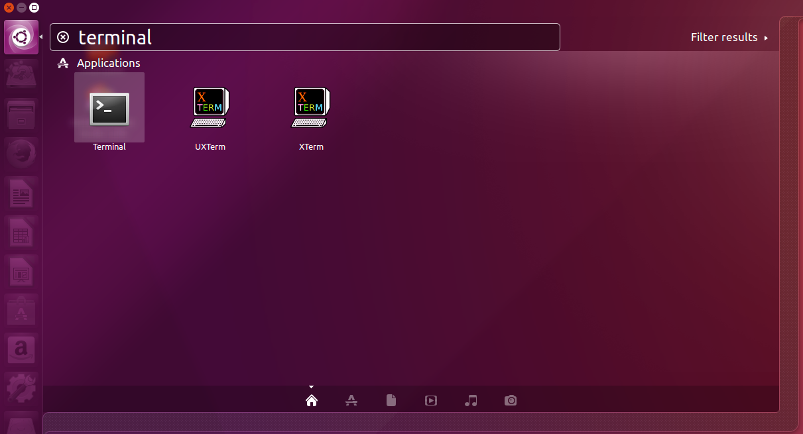

Once you have it open, check if you have access to your SD image file by using the command `ls /mount/ubuntu/OS/` and completing the path to the folder containing your image file. Mine was on my desktop, so I used  
  `ls /mount/ubuntu/OS/Users/Alton/Desktop/` to see what was there.

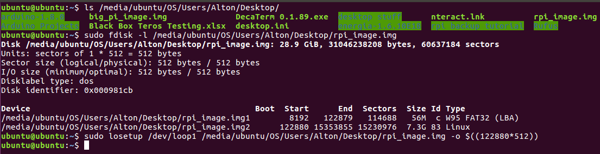

Next, you'll need to get some information about the image file's data so that we know what to cut and what to keep. Type in `sudo fdisk -l /media/ubuntu/OS/...` all the way to your `.img` file. In my case, I used  
`sudo fdisk -l /media/ubuntu/OS/Users/Alton/Desktop/rpi_image.img`.

As you can see, it output some information about our file. We can see that the image file contains two partitions. The first is the boot partition for the Raspberry Pi. We don't need to mess with that one. The second one is the one we need to shrink down. Right now the important thing is to take note of the Start sector of the second partition. In my case, that is `122880`. *Write it down.* Seriously, write it down, you'll need it.

Next, we'll use the loopback device to mount the image file onto the ubuntu file system as if it were actually a hard drive. This will let us get some more important information that we need in order to trim off all the unneeded pieces of the `.img` file. To do this, type `sudo losetup /dev/loop1 /media/ubuntu/OS/...` (insert the path to your `.img` file here) ` -o $((` Remember that number? `*512))`

For the sake of clarity, here's the full line the way I used it, with my path and my start number filled in:  
  `sudo losetup /dev/loop1 /media/ubuntu/OS/Users/Alton/Desktop/rpi_image.img -o $((122880*512))`

Next, we'll launch `gparted` in loopback mode by typing:  
`sudo gparted /dev/loop1`

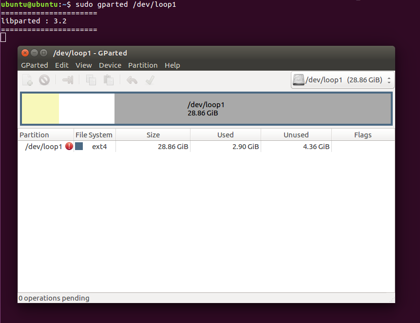

Click on the blue-bordered box that represents `/dev/loop1`, and then click the orange arrow that means "resize/move the selected partition."

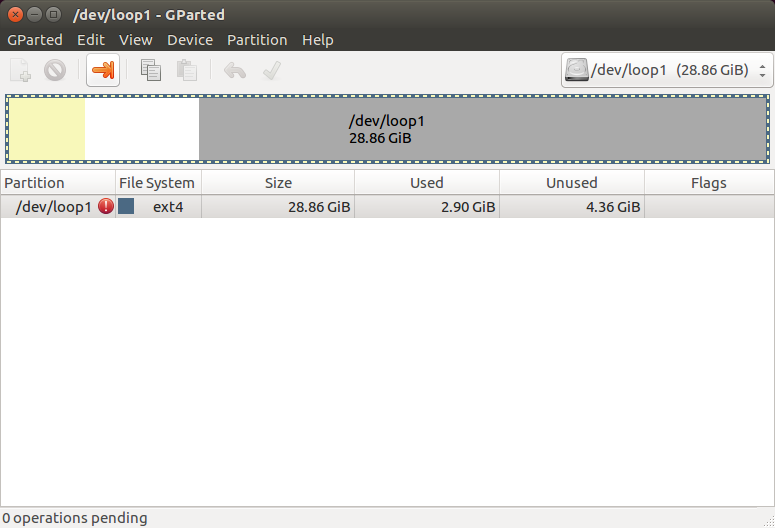

You'll see that the yellowed section represents used space, while the white section is unused space. The grey section is unallocated space. The minimum space that can be set is equal to the amount of space already occupied. It's best to leave a little extra room, so add 20 to the minimum and use that as the new size. Mine ended up being `3582`.

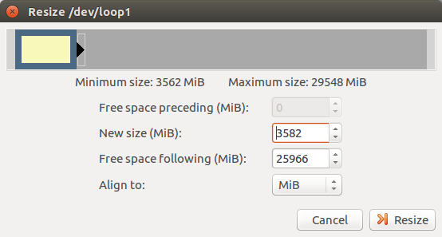

When that's ready, click Resize, and then click the green check mark. That will apply the changes. Wait for it to finish, but *don't close the window yet!* There is important information in the completion dialog.

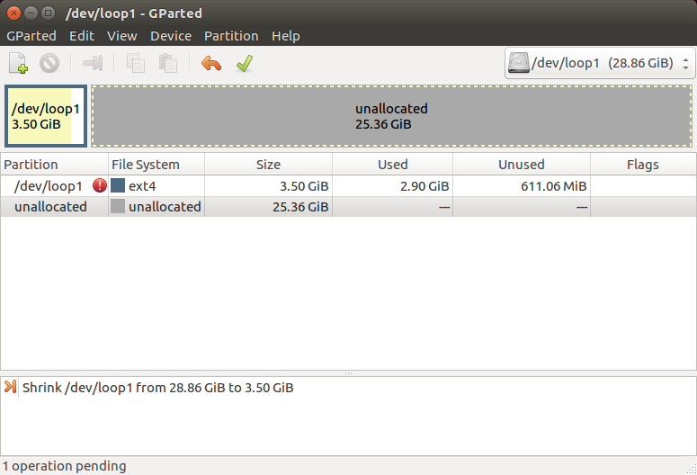

Open the details menu by clicking on the little grey triangle. Then open the line that says `Shrink /dev/loop1...` and also `shrink file system`. On the line that says `resize2fs-p /dev/loop1` there will be a number. Write it down, including the letter at the end, because we'll need it for the next steps. My number was `3667968K`.

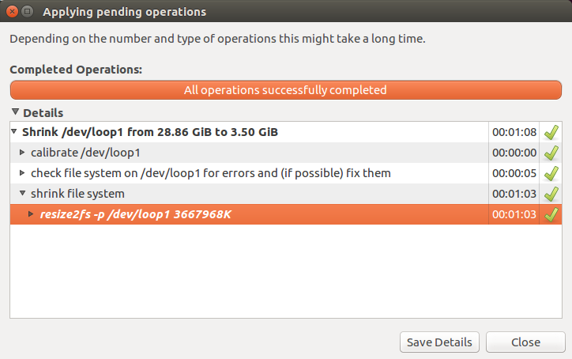

Now we're done with `gparted`, so you can close the dialog and quit the program. Go back to your terminal. We need to disconnect the loopback and make a new one that contains thw whole `.img` file. To do this, type:  
`sudo losetup -d /dev/loop1`
and then:  
`sudo losetup /dev/loop1 /mount/ubuntu/OS/Users/Alton/rpi_image.img`  
Replace the path to your `.img` file with the correct path.

We'll use fdisk again, but this time we're going to tell the OS to re-index the partition in order to get the last piece of information we need. Run fdisk by typing `sudo fdisk /dev/loop1`. Then, enter `d`, `2`, `n`, `p`, `2`, pressing enter after each.

Now you'll have to use some of the numbers that you wrote down. At the `First sector` prompt, enter the first number you wrote down. Mine was `122880`. At the `Last sector` prompt, enter the next number, but *make sure to put a plus sign before it!* In my case, that looks like `+3667968K`. After that is entered, enter `w`. There will be a warning that pops up after the `w` command; ignore it. It doesn't apply to what we're doing here.

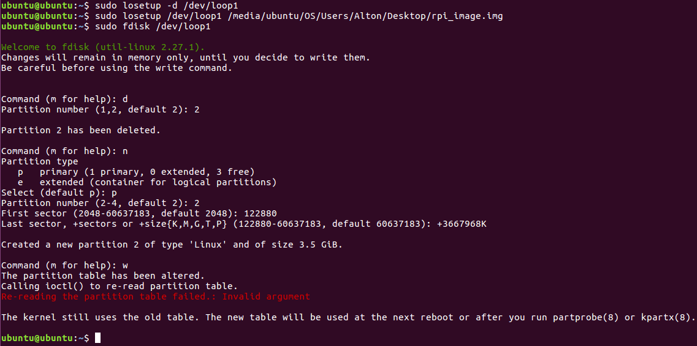

Now we run fdisk one more time in order to get our last piece of data. Type `sudo fdisk -l /dev/loop1`. You might notice that the displayed disk size is much smaller than before. Great! We need to write down the end sector of the second partition. In my case, that is `7458815`.

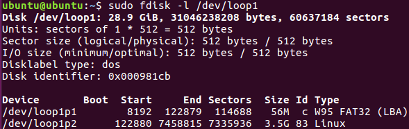

Once you've written that down, go ahead and close the loopback device by typing `sudo losetup -d /dev/loop1`.

Now it's time to truncate the `.img` file. Enter `truncate -s $(((END+1)*512)) /mount/ubuntu/OS/....img`, replacing the path and the end number with the appropriate values. For example, I typed:  
`truncate -s $(((7458815+1)*512)) /mount/ubuntu/OS/Users/Alton/rpi_image.img`

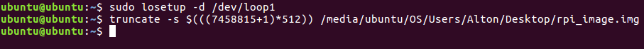

That's it! Your image file has been trimmed down. Go ahead and shut down your computer and boot into windows (simply remove your USB drive when the computer is off, and then power up).
***

###### Storing the `.img` file as a backup:  
If you want to store the image as a backup, it's best to compress it so that it doesn't take up so much space. To do this, right click, select `new >`, and select `compressed folder`.

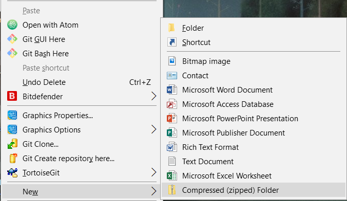

Next, drag your `.img` file into your compressed folder and wait for the compression to finish.

***

###### Restoring the backup to a new SD card:  
When you're ready to restore the backup to a new SD card, open up that compressed folder and extract the `.img` file.

Plug in your new SD card and open up Win32DiskImager. Make sure that your card is large enough for the image file to fit. It should probably be about 4 GB or bigger. Enter the path to your extracted `.img` file, or click the folder button and browse to it. After making sure that you are writing to the correct device, click the `Write` button to start restoring your disk image.

When it is finished, eject your new Raspberry Pi card and insert it into your Pi. Turn it on, and once it's booted, enter `sudo raspi-config --expand-rootfs` to expand the file system to fill the entire card. Then use `sudo shutdown -r now` to reboot, and you're ready to go!
***
